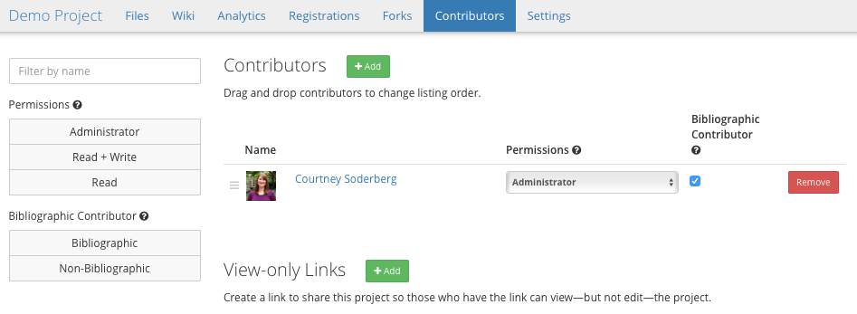
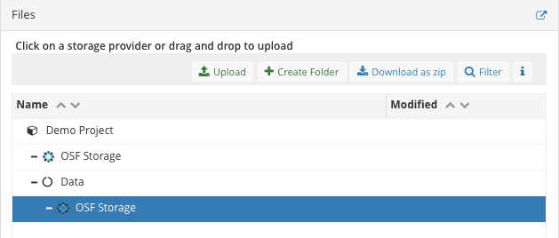
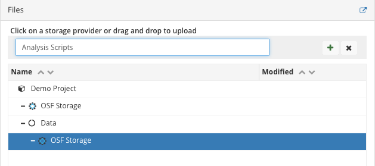

# Setting up a collaborative space

## Learning objectives
* Understand how to set up a centralized location for project storage/management
* Understand the purpose and use of the wiki
* Understand use and importance of subfolder/subcomponent organization

## Materials Overview
Hopefully you all had a chance to skim over some of the files I emailed to you yesterday. The files are a small subsection of materials from the 2012 Annual National Election Survey in the US, which we will be using as our example materials for today's
workshop. Don’t worry, you don't need to know anything about US politics or elections; it is simply a dataset that can be easily understood no matter what your scientific discipline or level of experience is. It will allow all of us to collaborate even if you are in a group with people from a variety of scientific fields. 

I emailed you the materials this morning. If you open up the filed called, ‘Questionnaire’, you’ll notice that there are about 12 different questions that respondents were asked to answer were (this is a very small subsample of the questions from the actual survey). Over the course of this workshop, each group will decide amongst themselves, from the available materials, what their research question will be, variables they want to use, analyses they want to perform, how they want to build and structure their project, and how open they would like the project to be at the end. 

## Creating a project

We talked before about some problems that can arise when we either don’t document our work or we try to back track and document our work after a study is accepted for publication. This becomes even more challenging when you have multiple collaborators, often times at different institutions, who send materials back and forth by email. What you frequently end up with is a very distributed network of materials, with some documents on your computer and Dropbox or different versions of files in various email threads. This makes it difficult to recreate your workflow or find particular files. In order to begin to solve some of these problems, we will use the OSF to set up a collaborative space. This will help us document and organize our research study in a centralized location.  

Now that you are all signed in, you should see the `project dashboard`. This is where you will start each new `project`. A `project` on OSF can be anything: a lab group, an organization, a grant, a line of research, an individual experiment, etc. Think of your project as the top level of a nested structure. You’ll be able to nest as many things under it as you like. Different researchers and labs may have certain preferences about what they choose as their top level project. 

Since we don’t have any projects yet will be only working on one research project, let's create a project for that one study. If you are the PI in your group, please click on the ‘create project’ button and give the project whatever title you choose. If you would like to give the project a short description you may, but there will be space later to add a longer description. Go ahead and create the project:

> Activity: PIs create new project

If you are a PI, you should now see something that looks similar to my screen. If you aren’t a PI, you can follow along on my screen for the moment. This is the `project overview page`. Any project you create on the site will start out looking similar to this. You can then customize it to fit the needs of your particular project or workflow. The system was built to be very discipline agnostic, which is why projects start out so bare. 

The `project overview page` has a few different sections. The `wiki` is a collaborative editing space that you can use to include important overview information about the project, including things like READMEs, abstracts, research questions, outlines, etc. The `file tree` is how you upload and navigate to files in the system; most file types are accepted such as CSVs, Word documents, PowerPoint slides, PDFs, and image video files. The `component` section is how you add additional structure and nesting to your project (we will talk more about this later). You will also see the `citation` widget, which displays the automatically generated citation for the project:

In your brower's search bar, you will notice a 5 letter string at the end of the osf.io url. This entire web address is a GUID, or a permanent, unique identifier. This address has been assigned to this project page and will always point back to it unless the project is deleted. 

## Giving contributors access

If you are a acting as a graduate student or RA in your group, go ahead and type in the GUID of the project your PI created.

> Activity(Question): What are GS & RAs seeing after typing in GUID?

If you aren’t a PI, you should be seeing a screen telling you that you don’t have access to the project. That’s because all projects on the OSF are set to `private` as a default. This means that only people who have been added as `contributors` to the project have access to it and can see and/or edit it. Right now, the PI is the only contributor on the project because they created it.  Since we want this to be a collaborative project, we need to give the other two members of your teams access to the project. If you go up to the `sharing` tab and click on that, this is how you can add people as contributors.

I can search for people who I want to add as collaborators, then click the + icon to add them to the project. 

You’ll notice that each person is given a permission setting for access to the project. There are three possible settings, `admin`, `read + write`, and `read`. Read access means the contributor can see into the project and can download any files they want, but they will not be able to add any files or modify any content. Contributors with Read + Write access have additional capabilities to add and modify files, but they can’t change any of the settings on the project (so for example they can’t add new contributors or change the privacy settings on the project). An administrator can do anything to the project and files. I can assign different permission settings to different contributors if I need to.

 

PIs, go ahead and add your graduate student and RA collaborators to your project. You can decide what level of access you want to give them, but keep in mind that later on both are going to need the ability to upload files.

> Activity: PIs add other groups members as contributors

Grad students and RAs, if you try the GUID again, you should now be able to see the project page. Is everyone seeing their project page?

If we now go back to the project overview page, you’ll notice that all three people are listed as contributors on the project, and that they are all now also listed in the auto generated citation for the project.

If for some reason you wanted to give someone access to the project but did not want to give them authorship credit, perhaps your RA needs access to the project but you don’t generally give your RAs authorship, just acknowledgements, you can do this by going back to the ‘sharing’ screen and unchecking the ‘bibliographic contributor’ box next to that person’s name.

## Creating a wiki

Now that you have a project and everyone has access, the first thing to do is start to write down a bit of information about the project, like why we’re doing the project, what our initial research question is, etc. By documenting this upfront, it will be very easy for us to always go back and see how the project started out, as it evolves over the course of the research lifecycle. Depending on how exploratory or confirmatory the study is, this section may start our pretty loose or very detailed. On the OSF, a good place to put this type of information is in the wiki. The wiki is a real time collaborative editor, so your whole team can work on it at once. It also can be formatted using markdown if you want to get fancy. You get into the wiki by clicking on the widget, and then click on the ‘edit’ button in the upper right to open up the editor. 

Lets have you all take a minute to set up a wiki for the project. So, take a few minutes to discuss amongst your group what you are interested in looking at in the ANES dataset I gave you, then collaboratively enter your research question and hypotheses, if you have them, into the wiki. 

> Activity: Create wiki with RQ and hypothesis

## Adding organizational structure 

Right now our project is pretty flat. It is basically just one big folder with a wiki with some basic content in it. For most projects, we’ll want to add some structure by adding sections to organize related files, for example we might want to organize all our data files together and separate those from files related to protocols or study materials. If we had set up a project for a lab group or an institution, you might imaging having separate sections for each person in the lab, or each line of research. You can do this in two ways on the OSF depending on your preference. The major way to add structure to a project is to add `components`. You do this by clicking the `add component` button on the right of the screen. You can name the component whatever you want (materials, data, protocol, IRB, etc.) and you can also give it a category. 

Once the component is created, we can go into it and see that the inside of all components looks just like an empty project; they have their own file trees, wikis, contributor lists, and privacy settings. We can also nest components within components. So, components are a way to organize different types of files in a project, but they also allow you to set up areas that have different privacy settings or contributor lists from other sections in the project, which can be important for having fine grained control over access to different parts of a project.

		

Folders are another organization option that function a bit differently. A folder is literally just a way to group a set of files, nothing more. So, if we click on the OSF storage icon you’ll notice that a `create folder` button will appear. 

If we do this, a folder will appear which he can then name whatever we want. 

However, if you click on the folder, it will just expand; you won’t be taken into the folder and it doesn’t have a wiki or it’s own access settings; the access settings are the same as the project/component is under. So, folders are just about organizing files together, while components are good for setting up large sections of a project.

  

Now that I’ve explained the difference between components and filers, I’ll give you a bit of time to set up some initial structure for your project. You can set it up however you want, there isn’t necessarily a right or wrong answer. Also, you can always move things if you initially set it up in one way and your realize that it would be better to set it up in another way later on. Just think through what are the major categories of file types you’ll have, and whether you might want to have different contributors or public vs. private access setting for them to determine whether you want to set them up as folders or components.

> Activity: Create project structure using folders/components
